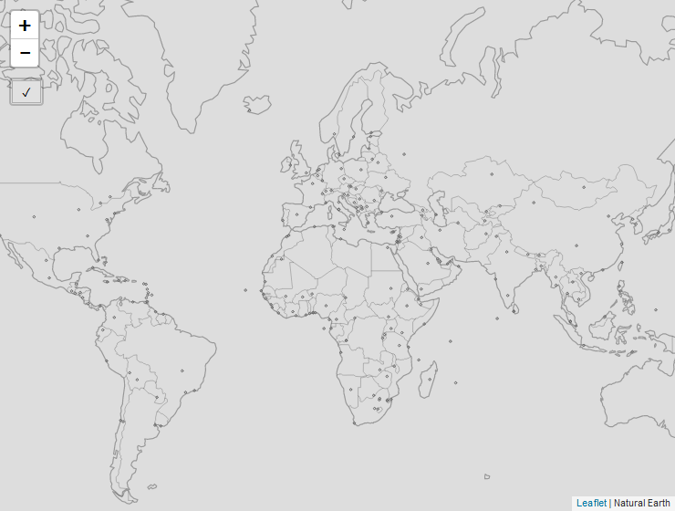

# Offline maps playground

An experiment in storing and displaying custom vector tiles from IndexedDB (using [level-js](https://github.com/maxogden/level.js)).

Work in progress

## Demo

[http://npeihl.com/offline-maps-playground](http://npeihl.com/offline-maps-playground)

Click the checkmark button to save map layers into IndexedDB. When complete the layers should display on the map. The map layers persist even after reload and in an offline state.

## What's going on here?

On the first load you are presented with a blank map canvas. When you click the checkmark button, the web application downloads [Natural Earth](http://naturalearthdata.com) GeoJSON files from [GeoJSONXYZ](http://geojson.xyz). 

These GeoJSON files are then converted into [Mapbox Vector Tiles](https://www.mapbox.com/vector-tiles/) within the browser. These tiles are stored in the browser's [IndexedDB](https://developer.mozilla.org/en-US/docs/Web/API/IndexedDB_API) database for offline use. Progress is logged in the browser developer console.

After the tiles are stored, a custom Leaflet module based on [Leaflet.VectorGrid](https://github.com/Leaflet/Leaflet.VectorGrid) is used to request and display the tiles from IndexedDB as a custom [offline-first](http://offlinefirst.org/) basemap. The basemap tiles persist for display even after closing and reopening the browser. Clicking the checkmark button again refreshes the tile cache.

The map's zoom levels are limited to between 0 and 5. This is because it takes a rapidly increasing amount of time and storage to construct tiles over zoom level 5 for the entire earth. Additionally, the Natural Earth datasets being used are designed for small scale maps. We could limit the map extent to a small area and introduce regional datasets for a local offline map (see [this commit](https://github.com/nickpeihl/offline-maps-playground/tree/12eac18f54debbf8835b5056a5630cbaccd0f1ad)).
